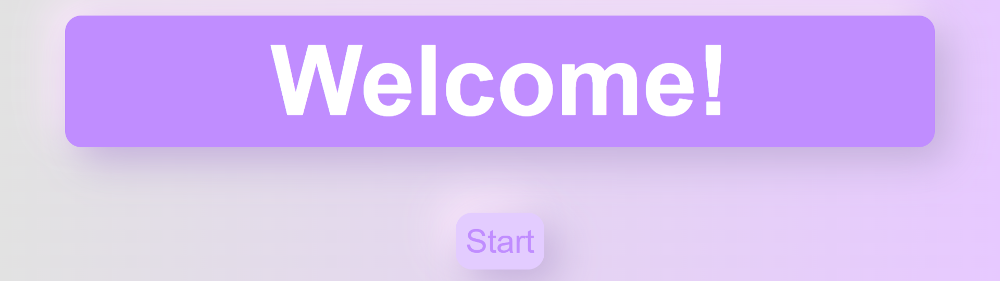
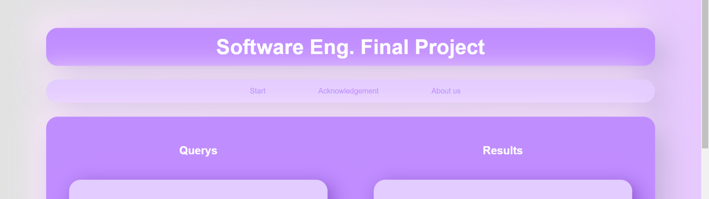
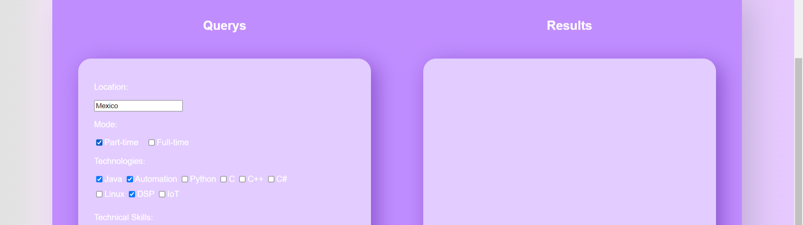
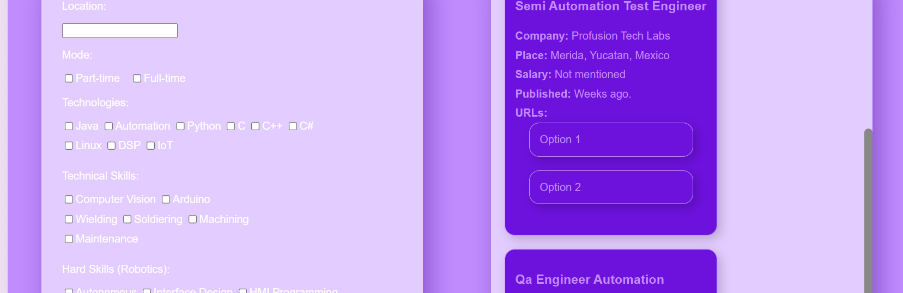

[](https://www.python.org/)
[](https://flask.palletsprojects.com/)
[](https://docs.python.org/3/library/asyncio.html)
[](https://docs.aiohttp.org/en/stable/)
[](https://www.selenium.dev/)
[](https://docs.python.org/3/library/unittest.html)
[](https://developer.mozilla.org/en-US/docs/Web/Guide/HTML/HTML5)
[](https://developer.mozilla.org/en-US/docs/Web/CSS/CSS3)
[](https://www.terraform.io/)
[](https://www.docker.com/)

# Deployed Job Web Scraper Web App with Terraform AWS

This project is designed to demonstrate a powerful and scalable solution for scraping job listings and deploying web applications using modern technologies.The web application provides an intuitive interface for users to search for job listings based on specific criteria such as skills, location, and job type. It leverages several advanced technologies to deliver a robust and scalable solution.

## Index

- [Content Overview](#content-overview)
- [Installation](#installation)
- [Usage](#usage)
- [Expectations for future](#expectations-for-future)
- [Contributions](#contributions)
- [Credits](#credits)
- [License](#license)

## Content Overview

### 1. `app.py`

The Python code that serves the Web App by using `Flask`. It shows you the html templates working, and the principal page or route is `main.html` that it serves the main process of the web app, and then it has another three called `welcome.html`, `acknow.html`, `aboutus.html`  these were just made so that the page does not look empty.

### 2. `scraper.py`

This script performs asynchronous web scraping using `aiohttp` and `Selenium`. It configures a headless Chrome browser to fetch job listings from Google based on specified skills, location, and job type. The scraped data, including job details and descriptions, is saved in a JSON file. The scraper is designed to handle multiple queries concurrently and limits the number of job postings per skill to three.

### 3. `test_scraper.py`

This script contains unit tests for the asynchronous web scraper using the `unittest` module and `aiohttp`. It defines a TestJobScraper class to test the functionality of the JobScraper. The tests run the scraper with given skills, location, and job type, save the results to a JSON file, and verify the output is a dictionary with job data.

### 4. `templates/files`

This folder saves all the `.html` scripts that the Python codes will use for the web app.

### 5. `static/folders`

This folder saves all the scripts and folders that makes the HTML Templates look nicer, these includes the folders: audio, css, images.

### 6. `venv/`

Into this folder the Virtual Enviroment is saved, it is not needed to turn it on, it was created just for the development.

### 7. `requirements.txt`

Contains the required Python dependencies for the project, ensuring a consistent environment for the Dockerfiles to use.

### 8. `Dockerfile`

Configures the Docker image for the web app by setting up the working directory, copying the necessary files, and installing dependencies. It specifies the command to run the Flask Python script and also installs various components required for the web driver to connect to a web browser, as the scraper needs this to function correctly.

### 9. `docker-compose.yml`

Defines the Docker enviroment for the Docker image of the Web App, specifying the build context, and then it exposes port 5000 for accesing the Web App.

## Installation

1. Clone the repository:

    ```bash
    git clone -b master git@github.com:MDavidHernandezP/JobWebScraperWebApp.git
    cd "the proyect directory"
    ```
    
    OR:

    ```bash
    git clone https://github.com/MDavidHernandezP/JobWebScraperWebApp.git
    cd "the proyect directory"
    ```

2. (Unfinished, read the `usage` section first) Build and run the Docker containers:

    ```bash
    docker-compose up --build
    ```

## Usage

After succesfully have cloned the repository, we do not recommend to build and run the containers, this because at the end of the project we had some problems making the webdrivers work with these, and as terraform doesn't need to use these, we didn't fix that, and we haven't yet. 

But if you want to run the project locally use the Virtual Enviroment, turn it on by using this command: `.\venv\Scripts\activate`, and then run the scraper.py script, just make sure you're in the correct folder before running it. And that's it you can access to it by getting into your localhost into the port 5000, just copy this url into your Web Browser: [http://localhost:5000](http://localhost:5000).

Once you are into the Web App, you will see a welcome page, hit the start button and it will redirect you to the home page, once there, you could see the navigation bar, and below the query and results section, in the query section you just have to write and select your preferences and hit the button submit once you've finished. Then the page will refresh and the jobs must appear into the results section. The other pages from the navigation bar are just info pages for convention, you can ignore them if you want to.









Also, the terraform scripts aren't here, you can see them into this repository: [https://github.com/LuisMichelP/Terraform-AWS-EC2](https://github.com/LuisMichelP/Terraform-AWS-EC2). Here you could see the scripts used for the deployment.

## Expectations for future

We are committed to improving this project as there are many unresolved issues and unfinished aspects, such as the Dockerized environment, the design of the results section, and other general aspects of the page. There are also some bugs with the scraper that we can definitely fix. We just need to fully dedicate ourselves to it. Additionally, we have new ideas and improvements we want to implement, such as potentially using Django instead of Flask for the web application. We are still considering our options.

## Contributions

Any contribution is accepted for this project we align with the MIT License for open source. If you are interested in contributing directly with us or just copy our code for an own project, you're completly free to do it. You can contact us by this email in case of doubts or contributions: `mdavidhernandezp@gmail.com`.

- **Steps for contributing:**
1. Fork the project.
2. Create a branch (`git checkout -b feature/new-feature`).
3. Commit your changes (`git commit -am 'adding new feature'`).
4. Push the branch (`git push origin feature/new-feature`).
5. Open a pull request.

## Credits

This project was originally created by a group team of Data Engineering Students for the subject Software Engineering.

1. MARIO DAVID HERNÁNDEZ PANTOJA
2. GERARDO HERNÁNDEZ WIDMAN
3. LUIS ARTURO MICHEL PÉREZ
4. OSCAR MARTÍNEZ ESTEVEZ
5. MOISÉS JESÚS CARRILLO ALONZO

## License

This project is licensed under the MIT License

MIT License

Copyright (c) 2024 Mario David Hernández Pantoja

Permission is hereby granted, free of charge, to any person obtaining a copy
of this software and associated documentation files (the "Software"), to deal
in the Software without restriction, including without limitation the rights
to use, copy, modify, merge, publish, distribute, sublicense, and/or sell
copies of the Software, and to permit persons to whom the Software is
furnished to do so, subject to the following conditions:

The above copyright notice and this permission notice shall be included in all
copies or substantial portions of the Software.

THE SOFTWARE IS PROVIDED "AS IS", WITHOUT WARRANTY OF ANY KIND, EXPRESS OR
IMPLIED, INCLUDING BUT NOT LIMITED TO THE WARRANTIES OF MERCHANTABILITY,
FITNESS FOR A PARTICULAR PURPOSE AND NONINFRINGEMENT. IN NO EVENT SHALL THE
AUTHORS OR COPYRIGHT HOLDERS BE LIABLE FOR ANY CLAIM, DAMAGES OR OTHER
LIABILITY, WHETHER IN AN ACTION OF CONTRACT, TORT OR OTHERWISE, ARISING FROM,
OUT OF OR IN CONNECTION WITH THE SOFTWARE OR THE USE OR OTHER DEALINGS IN THE
SOFTWARE.

---